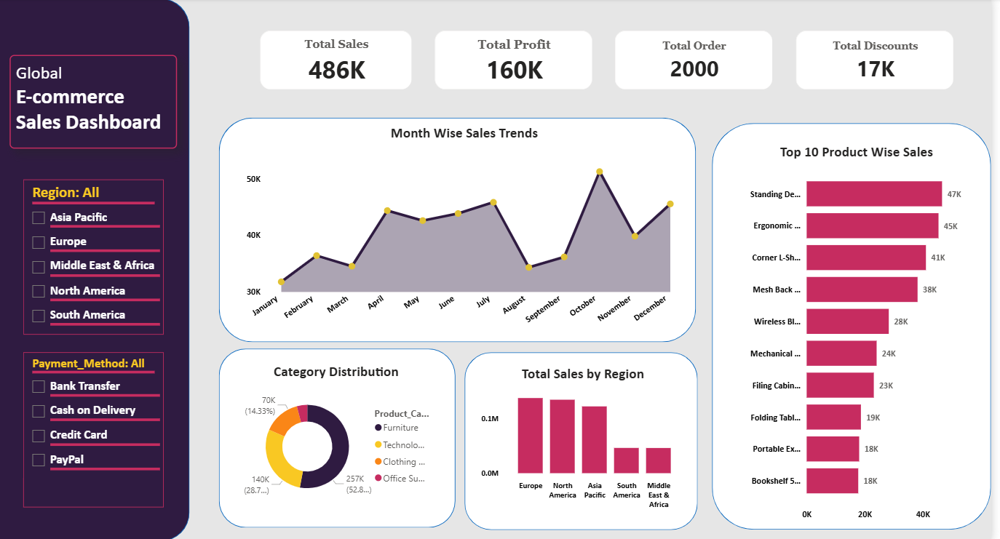

# Global E-commerce Sales Dashboard - Power BI

## Project Overview
This project is an interactive Global E-commerce Sales Dashboard built using Power BI.

The dashboard helps analyze:
- Global Sales Performance
- Profit Analysis
- Product-wise Sales
- Regional Sales Distribution
- Monthly Sales Trends
- Category-wise Performance
- Payment Method Insights
---
## Tools Used
- Power BI
- Power Query
- DAX
- Excel

---

## Key KPIs
- Total Sales
- Total Profit
- Total Orders
- Total Discounts

---

## Dashboard Features

### 1. Sales Analysis
- Month-wise sales trends
- Regional sales comparison
- Product category distribution

### 2. Product Performance
- Top 10 product-wise sales
- Best-selling products analysis
- Product contribution insights

### 3. Regional Insights
- Sales by region
- Global market comparison
- Region-based performance tracking

### 4. Payment Method Analysis
- Credit Card transactions
- PayPal usage
- Cash on Delivery insights
- Bank Transfer analysis
---
## Business Insights
- Europe and North America generated the highest sales.
- Standing Desk was the top-selling product.
- Sales peaked during October.
- Furniture category contributed the highest revenue share.
- South America and Middle East & Africa showed comparatively lower sales performance.
---
## Files Included
- Power BI Dashboard (.pbix)
- Dataset (.xlsx/.csv)
- Dashboard Screenshots
---
## Dashboard Preview

---
## How to Use
1. Download or clone the repository
2. Open the `.pbix` file using Power BI Desktop
3. Refresh dataset if required
4. Explore dashboard interactively
---
## Folder Structure

```bash
Dashboard/
Dataset/
Images/
README.md
Author
Jisu Paul
